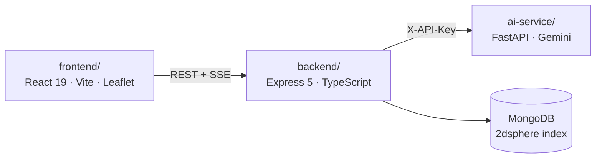
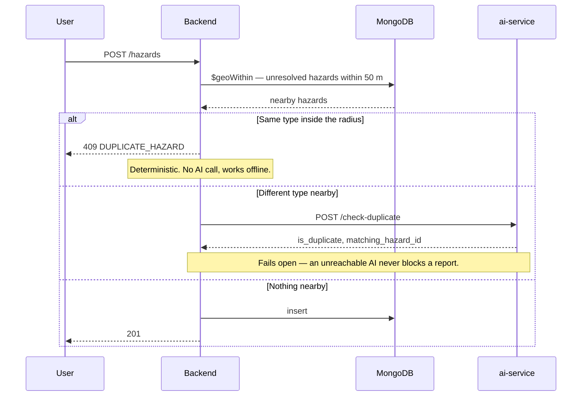

# CityScan

[](https://github.com/alon1406/CityScan/actions/workflows/ci.yml)

**Turn every citizen into a city sensor.** A map-based platform where residents report
urban hazards — potholes, broken streetlights, debris, flooding — and see them on a
shared, live map. One place for reports, one view for the city.

The interesting part is **two-tier duplicate detection**. Municipalities drown in the
same pothole reported eleven times; residents have no way to know it was already
raised. CityScan answers that in two stages: a geospatial query catches the certain
case in milliseconds, and an LLM adjudicates only the genuinely ambiguous ones.

---

## Architecture

Three services, each in the language that suits it.


```mermaid
flowchart LR
    FE["frontend/<br/>React 19 · Vite · Leaflet"]
    BE["backend/<br/>Express 5 · TypeScript"]
    AI["ai-service/<br/>FastAPI · Gemini"]
    DB[("MongoDB<br/>2dsphere index")]

    FE -- "REST + SSE" --> BE
    BE -- "X-API-Key" --> AI
    BE --> DB
```

The backend is built in strict layers, mirroring a previous Spring Boot project so the
same architecture reads identically in two languages:

```
backend/src/
  boundaries/     DTOs — the wire contract. Each file also exports its Zod schema,
                  with the type derived via z.infer so the two cannot drift.
  controllers/    HTTP only. No try/catch, no hand-picked status codes.
  converters/     Entity ⇄ Boundary. Where the password hash physically cannot leak.
  data/           Mongoose schemas, enums, demo fixtures.
  errors/         Exceptions that carry their own HTTP status.
  logic/          Service interfaces — what the application can do.
    impl/         Implementations — all business logic lives here.
  repositories/   Queries only. The $geoWithin radius maths lives here, not in a service.
  routes/         URL mapping and guard chaining. The authorization policy is
                  readable from these files alone.
  config/         Profile-based configuration, validated with Zod at boot.
  middleware/     Auth, validation, roles, rate limiting, the single error handler.
  scripts/        Seeding and maintenance entry points.
  container.ts    Composition root — dependency injection, by hand.
```

One rule holds it together: **each layer only knows the one below it.** `data/` does not
know `logic/` exists; `logic/` does not know HTTP exists. That is what lets the business
logic be tested without a server, and the LLM provider be swapped without touching it.

Full write-up, in Hebrew — every folder, the request lifecycle, and how a report
actually reaches the database:
[`docs/CityScan-System-Guide-HE.pdf`](docs/CityScan-System-Guide-HE.pdf)
· [HTML](docs/cityscan-system-guide.html)

---

## How duplicate detection works


```mermaid
sequenceDiagram
    participant U as User
    participant BE as Backend
    participant DB as MongoDB
    participant AI as ai-service

    U->>BE: POST /hazards
    BE->>DB: $geoWithin — unresolved hazards within 50 m
    DB-->>BE: nearby hazards

    alt Same type inside the radius
        BE-->>U: 409 DUPLICATE_HAZARD
        Note over BE: Deterministic. No AI call, works offline.
    else Different type nearby
        BE->>AI: POST /check-duplicate
        AI-->>BE: is_duplicate, matching_hazard_id
        Note over BE,AI: Fails open — an unreachable AI never blocks a report.
    else Nothing nearby
        BE->>DB: insert
        BE-->>U: 201
    end
```

**Tier one is deterministic.** An unresolved hazard of the *same* type inside the radius
is a duplicate, full stop — a `$geoWithin` / `$centerSphere` query against a `2dsphere`
index. No latency, no external dependency, works with the AI service down.

**Tier two is judgement.** It runs only when nearby hazards are of a *different* type,
where "debris" and "flooding" five metres apart may or may not be the same physical
problem. That question goes to Gemini.

**Tier two fails open by design.** If the AI service is unreachable, the report goes
through. A citizen must always be able to file a report, even when an optional
dependency is down — which is also why duplicate detection is not delegated to an
automation tool.

---

## Features

| Feature | Implementation |
|---|---|
| Hazard reporting with precise location | Leaflet map click, stored as flat lat/lng plus GeoJSON |
| Duplicate prevention within 50 m | `$geoWithin` + `$centerSphere` on a `2dsphere` index |
| Ambiguous duplicate adjudication | Google Gemini, behind a server-side proxy so the key never reaches the browser |
| Automatic photo description | Gemini vision |
| Address autofill and search | Nominatim, forward and reverse — no API key |
| Live map updates | Server-Sent Events |
| Photo storage | `sharp` → WebP at ~10% of the original, EXIF stripped |
| Auth and roles | JWT, bcrypt, route-level role guards |
| Input validation | Zod schemas applied at the route boundary |
| Admin panel | Filter by status and type, search, change status |
| One-click demo access | Guest accounts, read-only for the demo admin |

### Why photos are compressed and stripped

A phone photo arrives as ~1.5 MB of base64. Stored inline it approached MongoDB's 16 MB
per-document ceiling and would have exhausted a free Atlas M0 in around a hundred
reports. Resized to 1600 px and re-encoded as WebP it lands near 150 KB, and only the
URL is persisted.

Stripping metadata is not only a size win: phone photos carry EXIF GPS, and these images
are displayed publicly on a map. The report already carries explicit coordinates, so
there is no reason to also publish the exact spot the reporter was standing.

---

## Getting started

### Prerequisites

- **Node.js 24+**
- **Docker Desktop** — for local MongoDB. Optional if you point at MongoDB Atlas instead.
- **Python 3.12+** — only if you want the AI features.

### 1. Install

```bash
npm install --prefix backend
npm install --prefix frontend
npm install
```

For the AI service:

```bash
cd ai-service
python -m venv venv
venv/Scripts/pip install -r requirements.txt     # Windows
# source venv/bin/activate && pip install -r requirements.txt   # macOS / Linux
```

### 2. Configure

```bash
cp backend/.env.example backend/.env.development
cp frontend/.env.example frontend/.env
cp ai-service/.env.example ai-service/.env
```

`backend/.env.development` already points at the local MongoDB. Add a
[Gemini API key](https://ai.google.dev) to `ai-service/.env` if you want the AI features;
without one, duplicate detection falls back to geo matching alone and says so at boot.

### 3. Run

```bash
npm run db:up --prefix backend    # local MongoDB — once per reboot
npm run seed:demo --prefix backend
npm run dev                       # all three services
```

Open http://localhost:5173 and click **Sign in as Admin (Demo)** — no registration
required.

To see duplicate detection: click the map on Dizengoff Street where a marker already
sits, and report another **pothole**. The submission is rejected.

---

## Environment profiles

`NODE_ENV` selects the profile, in the style of Spring's
`application-{profile}.properties`. Loading order is real OS environment →
`.env.{profile}` → `.env`, first one wins.

| | `development` | `production` | `test` |
|---|---|---|---|
| Database | local Docker | Atlas | in-memory, disposable |
| `JWT_SECRET` | optional, warns | **required, ≥32 chars, refuses to start** | set by the suite |
| CORS | unset allows all | **required** | — |
| Error body | includes stack | generic message, no stack | includes stack |
| Photos | `backend/uploads/` | Docker volume | temp dir, deleted |

Configuration is validated with Zod at boot and fails fast with a readable list of what
is missing. No module reads `process.env` at import time — that rule is what keeps the
loading order correct.

---

## API

| Method | Path | Auth | Description |
|---|---|---|---|
| `POST` | `/auth/register` | — | Register. Returns JWT + user. |
| `POST` | `/auth/login` | — | Log in. |
| `POST` | `/auth/demo-login` | — | Guest account, `{ role: "admin" \| "user" }`. |
| `GET` | `/hazards` | — | List. `limit`, `status`, `type`, `unsolved`. Photos omitted. |
| `GET` | `/hazards/nearby` | — | Unresolved hazards within a radius. |
| `GET` | `/hazards/stream` | — | **SSE** — live hazard events. |
| `GET` | `/hazards/:id` | — | One hazard, with photos. |
| `POST` | `/hazards` | JWT | Create. `409 DUPLICATE_HAZARD` if already reported nearby. |
| `PATCH` | `/hazards/:id` | JWT | Update. Reporter or admin. |
| `DELETE` | `/hazards/:id` | JWT | Delete, including its photo files. |
| `GET` | `/hazards/mine` | JWT | The caller's reports. |
| `GET` | `/hazards/admin/list` | admin | All reports, with filters and search. |
| `GET` | `/hazards/admin/count` | admin | Open-report count for the nav badge. |
| `POST` | `/hazards/check-same-hazard` | — | Duplicate check without submitting. |
| `POST` | `/hazards/analyze-photo` | — | Describe a photo via the AI service. |
| `GET` | `/users/me` · `PATCH` | JWT | Profile. |
| `GET` | `/health/db` | — | DB state, active profile, whether AI is configured. |

Errors share one shape, written in exactly one place:

```json
{ "message": "…", "status": 409, "timestamp": "…", "path": "/hazards", "code": "DUPLICATE_HAZARD" }
```

---

## Testing

```bash
npm test --prefix backend
```

43 integration tests over a real `mongod` created fresh for each run via
`mongodb-memory-server` — no Docker required, no fixtures shared between cases.

Coverage worth noting: a regression test asserting tokens are **not** signed with the
old hardcoded fallback secret; unknown-email and wrong-password logins returning an
identical 401 so the endpoint cannot enumerate accounts; the demo admin being blocked
from writes; photos landing on disk as WebP and being deleted with their hazard; and the
AI path exercising its fail-open branch.

---

## Demo deployment

**The live demo runs entirely in the browser.** No backend is deployed yet, so the
frontend serves the same fifteen seeded hazards from a bundled fixture and keeps a
visitor's own reports in `localStorage`. File a report, change a status, delete one —
it all works, it is all yours alone, and it is gone when you clear site data. The
fixtures are shared with the backend seeder and a test asserts the two cannot drift.

Two things are honestly unavailable in that mode: photo description needs the AI
service, and tier-two duplicate adjudication needs an LLM. Tier one — the geospatial
50 m check — runs client-side, so reporting a second pothole on Dizengoff is still
rejected. That is the part worth seeing anyway: it is deterministic, and it is what
answers the request without an API call.

Once the backend is deployed, a nightly GitHub Actions job returns the shared demo to
its seeded state so the map does not drift into whatever the last visitor left behind.
The workflow is written and its schedule is commented out until there is a server to
point it at — see [`docs/demo-reset-schedule.md`](docs/demo-reset-schedule.md).

The reset endpoint is the most destructive thing in the codebase, so it is not
registered at all unless `DEMO_RESET_ENABLED=true`, and requires a shared secret
compared in constant time.

---

## Project layout

```
backend/        Express 5 + TypeScript, layered. 43 tests.
frontend/       React 19 + Vite + Leaflet + Bootstrap.
ai-service/     FastAPI + Gemini. Duplicate adjudication and photo description.
docs/           Architecture guide (Hebrew), deployment notes.
docker-compose.dev.yml    Local MongoDB — pinned image, named volume, healthcheck.
```

---

## Licence

MIT
